  

<strong>EN</strong> · <a href="#-versión-en-español">ES ↓</a>

## Hey, I'm Mateo 👋

I build **immersive web experiences** — interfaces that move, respond and feel alive. Most of my work lives at the creative edge of the frontend: **Vue 3, GSAP, WebGL** and smooth-scroll storytelling. I also ship what's underneath: REST APIs, Laravel and Node backends.

- 🎓 Thesis year at **Escuela Da Vinci** — class of 2026
- 🧠 Currently building **[Ynara](https://github.com/BriarDevv/Ynara)**, an on-prem adaptive AI personal assistant
- 🌒 Into dark UIs, editorial typography and terminals

## Featured work

| Project | About | Stack |
| :--- | :--- | :--- |
| **[Ynara](https://github.com/BriarDevv/Ynara)** | On-prem adaptive AI assistant that speaks rioplatense Spanish, with encrypted semantic / episodic / procedural memory. **Core contributor — 380+ commits.** | `FastAPI` `Next.js` `Expo` `pgvector` `Ollama` |
| **[Ynara-Web](https://github.com/MateoGs013/Ynara-Web)** | Immersive WebGL site: a form of light that morphs as you scroll. **Da Vinci thesis, 2026.** | `TypeScript` `WebGL` `GSAP` |
| **[Eros](https://github.com/MateoGs013/eros)** | An autonomous creative director with its brain in an Obsidian vault. | `Vue 3` `GSAP` `Lenis` |
| **[revelado](https://github.com/MateoGs013/revelado)** | A social network for photographers, built in phases as a university project. | `Vue 3` |

## Stack

  
  
  
  
  
  
  
  
  
  
  
  

## Contact

📫 **mateogabus@gmail.com**

---

🇦🇷 <strong>Versión en español</strong>

 

## Hola, soy Mateo 👋

Construyo **experiencias web inmersivas** — interfaces que se mueven, responden y se sienten vivas. La mayor parte de mi trabajo vive en el borde creativo del frontend: **Vue 3, GSAP, WebGL** y narrativa con smooth-scroll. También construyo lo de abajo: APIs REST, backends en Laravel y Node.

- 🎓 Año de tesis en **Escuela Da Vinci** — promoción 2026
- 🧠 Actualmente construyendo **[Ynara](https://github.com/BriarDevv/Ynara)**, un asistente personal de IA adaptativo y on-prem
- 🌒 Me gustan las UIs oscuras, la tipografía editorial y las terminales

### Proyectos destacados

| Proyecto | Descripción | Stack |
| :--- | :--- | :--- |
| **[Ynara](https://github.com/BriarDevv/Ynara)** | Asistente de IA adaptativo, on-prem y en rioplatense, con memoria cifrada semántica / episódica / procedural. **Contribuidor principal — más de 380 commits.** | `FastAPI` `Next.js` `Expo` `pgvector` `Ollama` |
| **[Ynara-Web](https://github.com/MateoGs013/Ynara-Web)** | Sitio inmersivo WebGL: una forma de luz que morfea con el scroll. **Tesis Da Vinci, 2026.** | `TypeScript` `WebGL` `GSAP` |
| **[Eros](https://github.com/MateoGs013/eros)** | Un director creativo autónomo con su cerebro en un vault de Obsidian. | `Vue 3` `GSAP` `Lenis` |
| **[revelado](https://github.com/MateoGs013/revelado)** | Una red social para fotógrafos, construida por fases como proyecto de la facultad. | `Vue 3` |

### Contacto

📫 **mateogabus@gmail.com**

 

hecho con 🧉 y monospace

